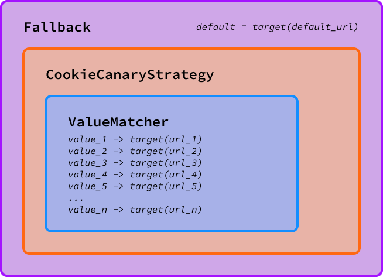

# canary

Canary is a HTTP server that handles deciding whether or not requests should be sent to a canary instance, and can track errors and redirect canary requests to non-canary instances in the case
that there is an unexpected increase in errors (i.e., when a canary deploy causes unexpected errors). This way, botched deploys of canary instances do not have serious ramifications for users 
of the application, and can be resolved before allowing traffic back onto them.

## Design

Canary is built on a chain of functions, similar to the `http.Handler` implementation in the go standard library. A `Strategy` can implement a simple behaviour (such as returning an error if no destinations were found) and then these can be used in conjunction with other `Strategy` implementations to build a tree of behaviours, reducing code repetition.

Take the following example:

We want canary to route users based on if they are assigned a canary instance to visit in their cookies. If they do not have a cookie choosing their canary, we should just default to the "production" instance.

This would consist of the following `Strategy`s:
- `Fallback(default=target(url))`: Returns the production instance as a destination if no matches in subsequent handlers.
- `CookieCanaryMatcher`: Finds a canary based on the user's cookie and the given `Matcher`
- `ValueMatcher`: A matcher that finds a destination based on the given value.

If we wanted to make the `CookieCanaryStrategy` aware of potentially unhealthy canaries, we can add in the `AwareTargeter` strategy, which tracks the responses that the canaries provide and if they recognise degraded performance, they let the production instance handle it instead. In practice, this now becomes:
- `Fallback(default=target(url))`
- `AwareTargeter`
- `CookieCanaryStrategy`
- `ValueMatcher`

Now, if the canaries experience degraded performance, then the requests are routed to the production instance, and users do not experience significant slow-downs beyond the initial period that is necessary to detect an unhealthy canary.

## Usage

The application is designed to sit between your incoming traffic, and other services. Canary does not consider load balancing - there are much better solutions for this. Instead, you should have your targets be pointing to load balancing if you need such.

This application can be used in two manners:
- as a binary built from `cmd/canary/canary.go` using the already present behaviours, or
- embedded within another go project, allowing custom `downstream.Target`s, `shedder.Handler`s, or `Strategy`s

### Binary (No extra behaviours)

(not yet ready)

TODO:
- [x] Server implementation
- [ ] Simple downstream target
- [x] Request ID handler
- [x] Fallback strategy (return a default target if no canaries match)
- [x] ErrorOnUnmatched strategy (return an error if no destination found)
- [ ] Implement analysis of responses, probably using `Mann-Whitney U` to detect impacted canaries. 

### Embedded (Extra behaviours)

Add this project to your go deps. When building a server, you can specify your own `Strategy`, `shedder.Handler` and `downstream.Target` implementations.

As well as this, you may also wish to modify the following:
- `InboundMutatorFuncs`: A slice of funcs of type `func (*http.Request)` that are ran before sending a request to a `downstream.Target`, allowing you to modify the request before being sent.
- `OutboundMutatorFuncs`: A slice of funcs of type `func (*http.Response)` that are ran before sending a response to the calling client, allowing you to modify the response from the downstream target before being sent back.

## License

MIT